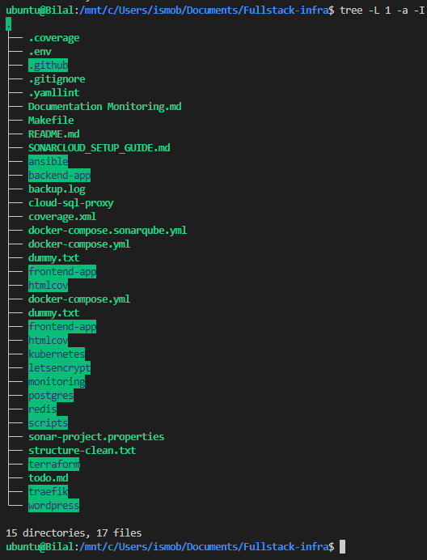

#  Projet de Déploiement Full Stack sur Google Cloud

Ce projet a pour objectif de déployer une application full stack avec une architecture trois tiers sur **Google Cloud Platform (GCP)**. L’objectif est de mettre en place une **infrastructure automatisée, sécurisée et supervisée**, avec deux environnements : **pré-production** et **production**.

---

##  Architecture

L'application est composée de trois couches distinctes :

-  **Frontend** : Application web React basée sur Vite
-  **Backend** : CMS WordPress conteneurisé
-  **Base de données** : MariaDB déployée dans un conteneur dédié

---

##  Outils et Technologies

| Catégorie              | Outils utilisés                               |
|------------------------|-----------------------------------------------|
| Cloud Provider         | Google Cloud Platform (GCP)                   |
| Infrastructure as Code | Terraform                                     |
| Configuration système  | Ansible                                       |
| Conteneurisation       | Docker + Kubernetes (K8s)                     |
| Load Balancer / Proxy  | Traefik                                       |
| CI/CD                  | GitHub Actions                                |
| Supervision            | Prometheus, Grafana, Netdata                  |
| Qualité du code        | SonarQube (via SonarCloud)                    |

---

##  Environnements

-  **Pré-production** : pour les tests et la validation
-  **Production** : pour la mise en ligne officielle

---

##  Objectifs du Projet

###  1. Automatisation de l’Infrastructure
- Déploiement via Terraform + Ansible
- Sécurisation par firewall, users limités, etc.
- Infrastructure scalable sur GCP

###  2. Déploiement Continu (CI/CD)
- Workflows GitHub Actions : build → test → deploy
- Gestion du stockage et des volumes persistants
- Docker Compose (en local) / K8s (en cloud)

###  3. Supervision et Observabilité
- Dashboards Prometheus + Grafana
- Alerting basique avec Alertmanager
- Netdata pour la supervision système

---

##  Sécurité

- Accès SSH restreint et surveillé
- Séparation des environnements
- Pare-feu strict (GCP VPC)
- SSL/TLS activé via Traefik
- Scan de vulnérabilités via OWASP ZAP *(à venir)*

---

##  Analyse de Qualité et Sécurité (SonarQube)

L’analyse statique de code est réalisée avec **SonarCloud**, déclenchée automatiquement à chaque push via GitHub Actions.
- Intégration continue avec SonarCloud dans les workflows GitHub Actions
- Analyse automatique de la **couverture de tests** (`pytest` + `coverage`)
- **Détection des bugs, code smells, duplications, et hotspots de sécurité**
- Respect des **standards PEP8** et bonnes pratiques Python
- Badges visibles dans le README pour suivre :
  - Le **Quality Gate**
  - Le **taux de couverture**
  - La **maintenabilité**
- **Bugs** : 0  
- **Code Smells** : 3  
- **Hotspots de sécurité** : 13 →  **100% Revu**  
- **Qualité globale** :  Passed  
- **Couverture des tests** :  87.8 %

###  Badges SonarCloud

  
  
  
  

---

##  Déploiement Automatisé

- Tout **push sur `main`** déclenche une analyse + déploiement
- Les workflows CI/CD automatisent :
  - L’analyse SonarCloud
  - Les tests unitaires
  - Le déploiement sur GCP via SSH + Docker/K8s

---

##  Fichiers Clés

| Fichier                            | Description                                      |
|-----------------------------------|--------------------------------------------------|
| `primordial-port-462408-*.json`  | Clé d’authentification GCP (service account)     |
| `todo.md`                         | Liste des tâches restantes                       |
| `.github/workflows/deploy.yml`   | Déploiement GitHub Actions                       |
| `terraform/`                      | Code IaC pour l’infra (VPC, instances, etc.)     |
| `ansible/`                        | Playbooks de configuration                       |
| `preprod/` et `prod/`            | Déploiement des services en environnements isolés|

---

##  Prochaines Améliorations

-  Scanner OWASP ZAP en CI
-  Ajout de tests e2e
-  Alertes Prometheus + Email
-  Génération auto de documentation technique

---

##  Auteur

**Ismail BILALI Issa Iyawa**  
Administrateur Systèmes DevOps  
 ismobilal@gmail.com

---

